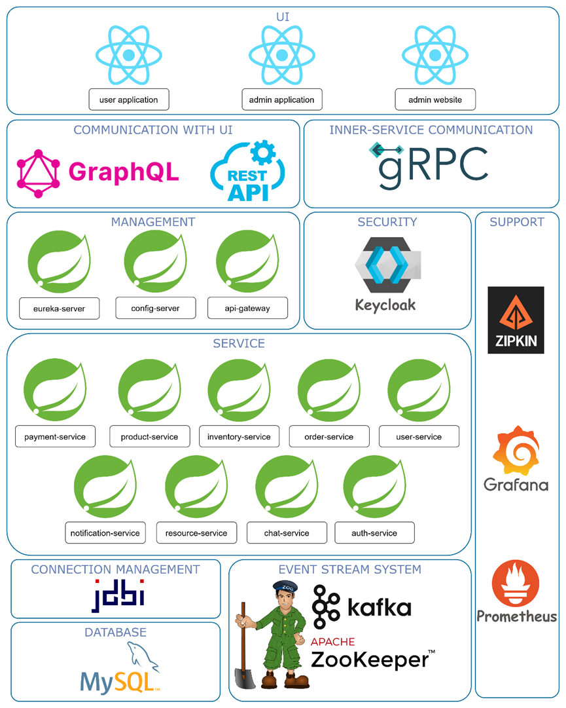
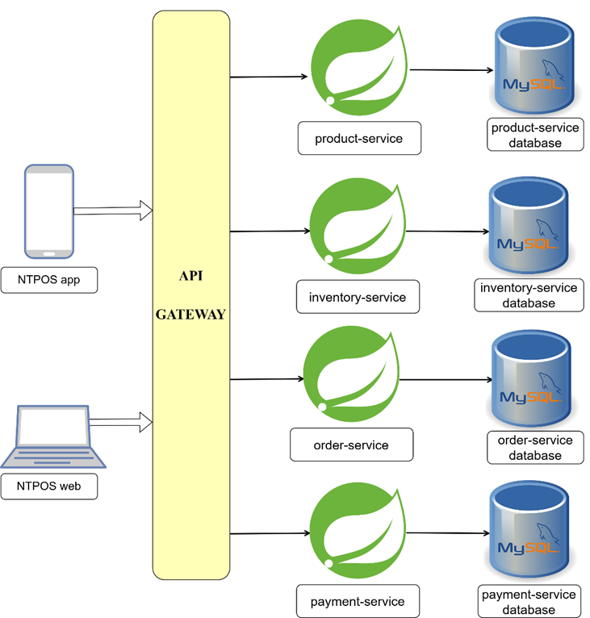
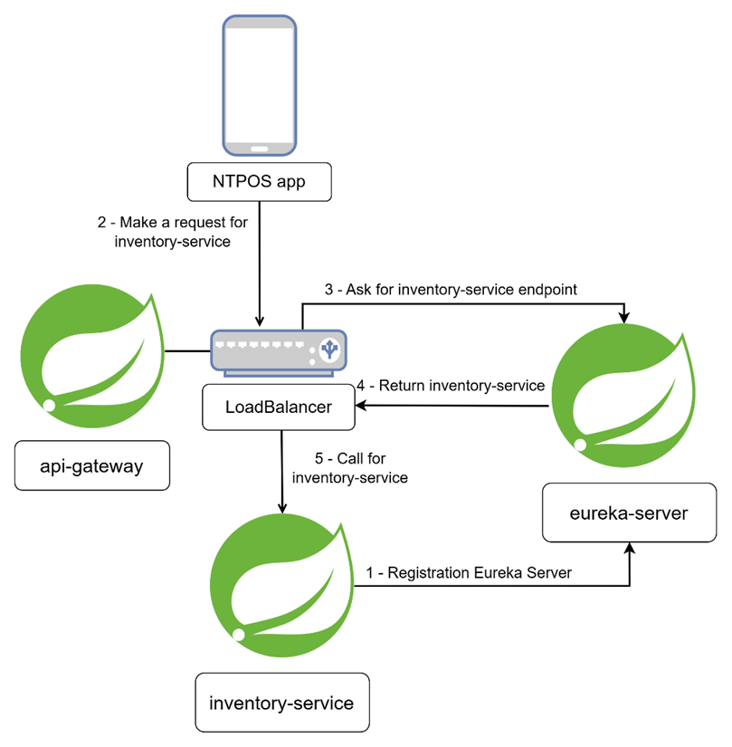
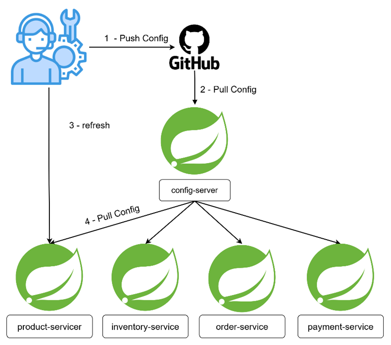
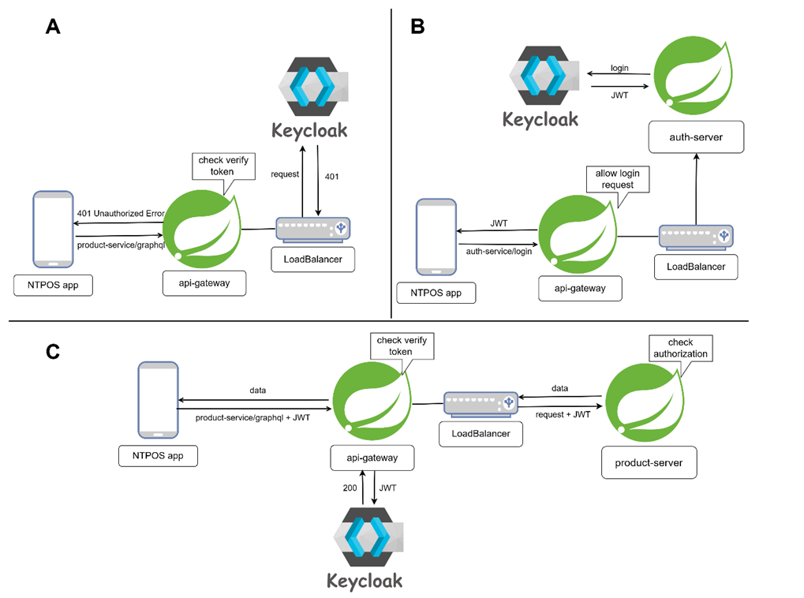
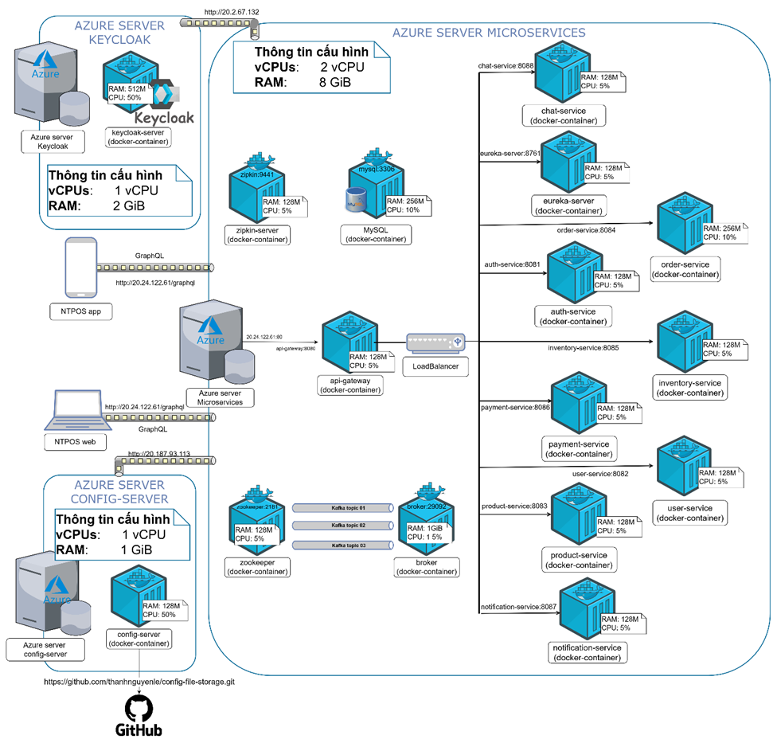

# BACKEND
Information: 
- JAVA 17
- SPRING BOOT 3.0.6
- TOMCAT 10
- SERVLET 5.0
- GRADLE 7.5

Architecture Pattern: Microservice
Description: Backend API Sales Management

# Software Architecture Overview  
  

## Each Service Stores Data in a Separate Database  
  

## Using Eureka Server for Service Discovery  
  

## Using Config Server to Manage Service Configurations  
  

## Applying OAuth 2.0 for Security and Authorization Across System Services  
  

# System Architecture Overview  
  